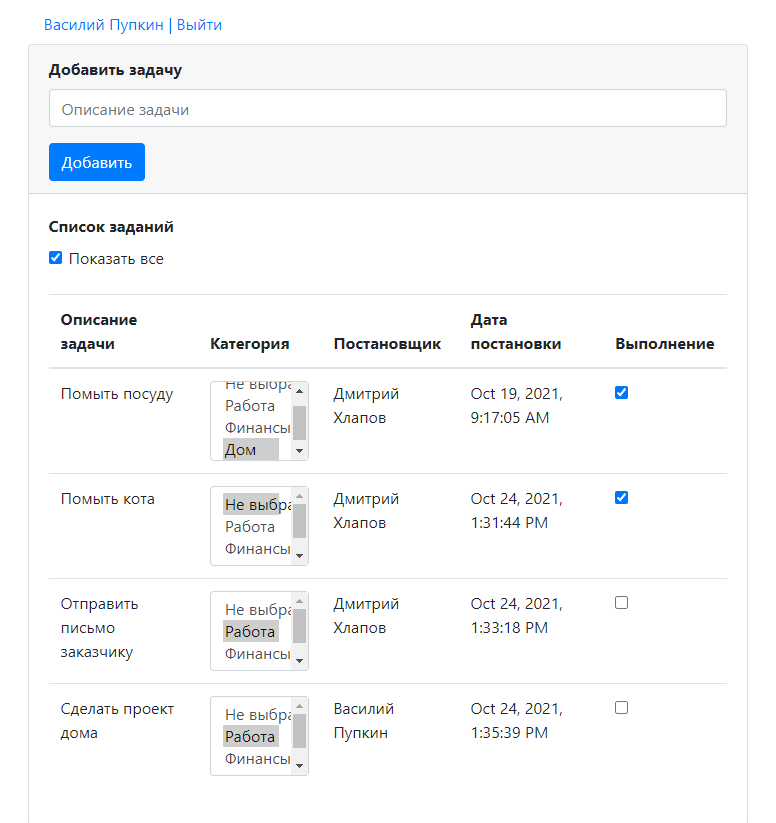

# Project job4j_todo

## Table of contents
* [General info](#general-info)
* [Technologies](#technologies)
* [Screenshots](#screenshots)
* [Contact](#contact)

## General info
job4j_todo app is a tool for managing tasks.
User can add tasks to the list and mark them completed.
Completed tasks disappear from the list.
You can show all tasks using a special checkbox.

## Technologies
* Java 15
* Java EE Servlets
* PostgreSQL
* Hibernate 
* Apache TomCat
* Apache Maven
* Javascript, AJAX, HTML, Bootstrap
* GSON

## Screenshots
#### New tasks

#### All tasks

## Contact
Created by Khlapov Dmitry - feel free to contact me!
